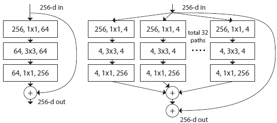

## SETI Breakthrough Listen - E.T. Signal Search

------------

### 결과

----------------

### 요약정보

* 도전기관 : 시큐레이어
* 도전자 : 왕승재
* 최종스코어 : 0.61918
* 제출일자 : 2021-10-21
* 총 참여 팀 수 : 768
* 순위 및 비율 : 672 (87%)

### 결과화면

----------

### 사용한 방법 & 알고리즘

* fast.ai
  * fast.ai 라이브러리는 pytorch 를 기반으로 만들어졌다. 
  * 이 라이브러리는 딥러닝 모델을 만드는 코드 스킬 없이 빠르게 딥러닝 모델을 학습시켜서 사용할 수 있도록 하는 것을 목표로 개발되어서, 복잡한 구현 없이 딥러닝 모델을 생성할 수 있다.
  * fast.ai 의 핵심은 모델 아키텍처의 선택과 함께 모든 중요한 데이터 선택 (예 : 전처리, 확대, 테스트, 교육 및 유효성 검사 세트, 다중 클래스 대 단일 클래스 분류 대 회귀 등)을 캡슐화한 클래스를 만든 것이다.
* ResNext50_32x4d 모델 (from pytorch image models [timm](https://github.com/rwightman/pytorch-image-models))
  * architecture의 구성 방식은 VGG와 ResNet이 사용하는 방식인 같은 layer들을 반복하는 것이다. 
  * 추가적으로 inception에서 사용되는 것과 비슷한 1개의 input을 여러 방향으로 쪼개는 split transform merge방식을 이용한다.
  * Inception-ResNet과 다른 점은 각 path별로 같은 layer구성을 가지고 있다는 점이다. 이는 grouped convolution이라고 한다.
  * 하이퍼 파라미터 cardinality(C)를 도입. 이는 size of the set of transfomation이다.
  * Cardinality는 model을 더 wider, deeper하게 만드는 것보다 정확도면에서 더 큰 이득을 볼 수 있다. 예를 들어 ResNet - 200 보다 ResNeXt - 100을 비교 했을때, ResNeXt-100 네트워크가 accuracy면에서 성능이 더 좋을 뿐만 아니라, complexity가 50% 가량 더 낮다.
  * 

-------------

### 실험 환경 & 소요 시간

* 실험 환경 : kaggle python nootbook (GPU)
* 소요 시간 : 약 30분

-----------

### 코드

['./SETI Breakthrough Listen - E.T. Signal Search.py'](https://github.com/essential2189/ML_study/blob/main/kaggle/SETI%20Breakthrough%20Listen%20-%20E.T.%20Signal%20Search/SETI%20Breakthrough%20Listen%20-%20E.T.%20Signal%20Search.py)

-----------

### 참고자료

[timm](https://fastai.github.io/timmdocs/)

[fast.ai](https://www.fast.ai/)
